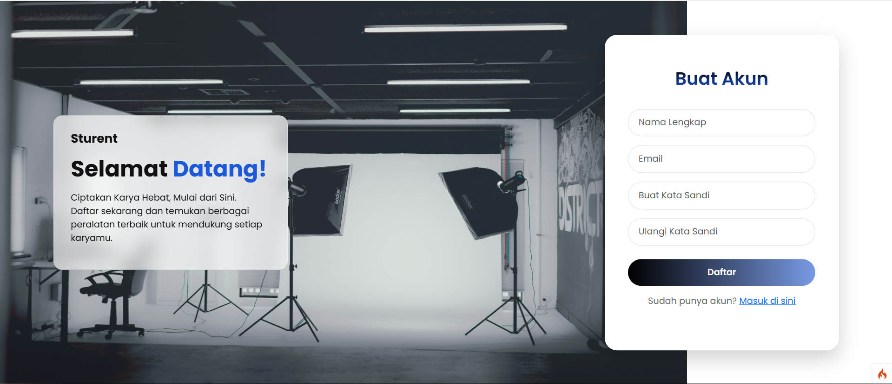
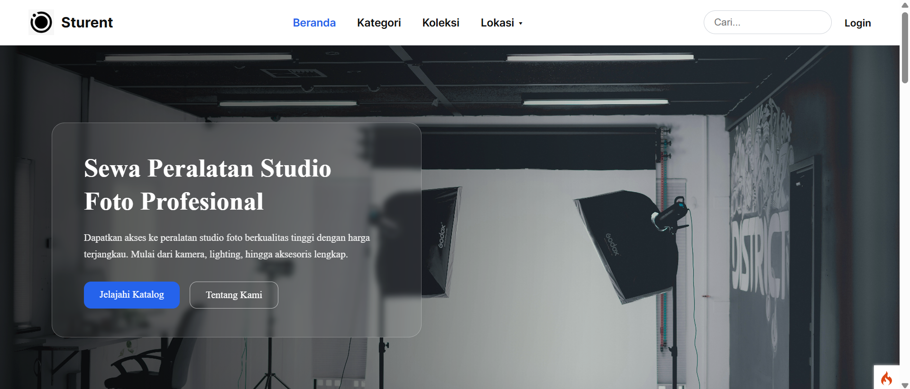
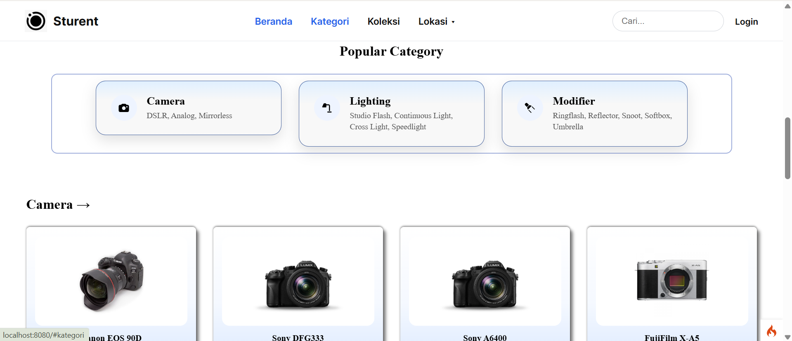
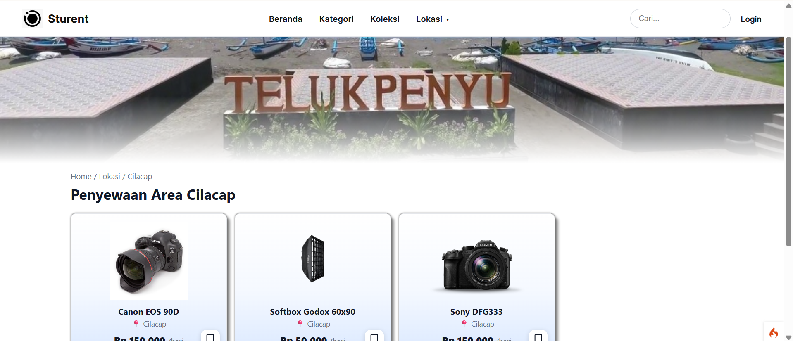

# Sturent- Rental Studio

## 📌 Deskripsi

Project ini adalah aplikasi web berbasis **CodeIgniter 4** yang dibuat untuk project akhir UAS Mata kuliah Pemrograman Web II.
Project ini dibuat secara berkelompok sebanyak 3 orang yaitu (Farhan, Majlista, Rona)

Fitur utama:

* 🔐 Login & autentikasi user 
* 📊 Manajemen data (CRUD)
* 📍 Beranda, Koleksi, Kategori, dan Lokasi Penyewaan

---

## 🖼️ Tampilan Aplikasi

### 🔹 Halaman Home


### 🔹 Halaman Login



### 🔹 Dashboard



### 🔹 Example Category



### 🔹 Example Location



---

## ⚙️ Cara Menjalankan Project

### 1. Clone repo

```bash
git clone https://github.com/username/nama-repo.git
cd nama-repo
```

### 2. Install dependency

```bash
composer install
```

### 3. Setup environment

Copy file `.env.example` atau buat `.env` lalu isi:

```env
CI_ENVIRONMENT = development

database.default.hostname = localhost
database.default.database = dipw2
database.default.username = root
database.default.password =
database.default.DBDriver = MySQLi
```

### 4. Import database

Import file SQL ke database `dipw2`

---

### 5. Jalankan server

```bash
php spark serve
```

Akses di:

```
http://localhost:8080
```

---

